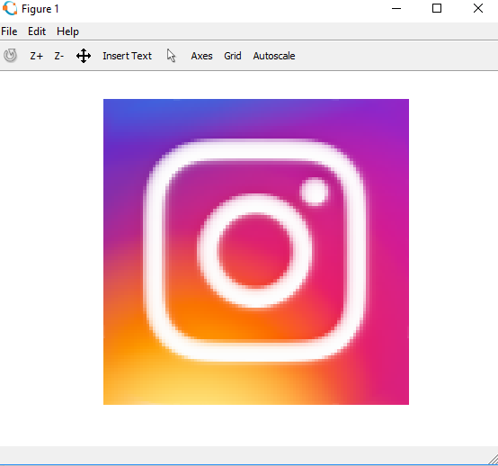
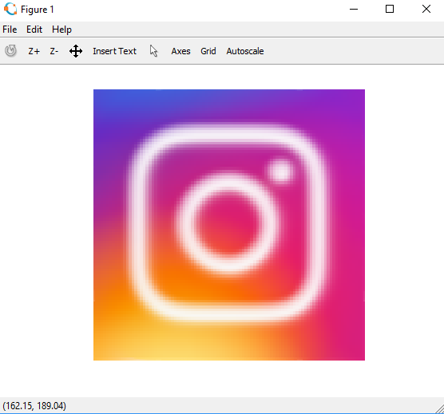
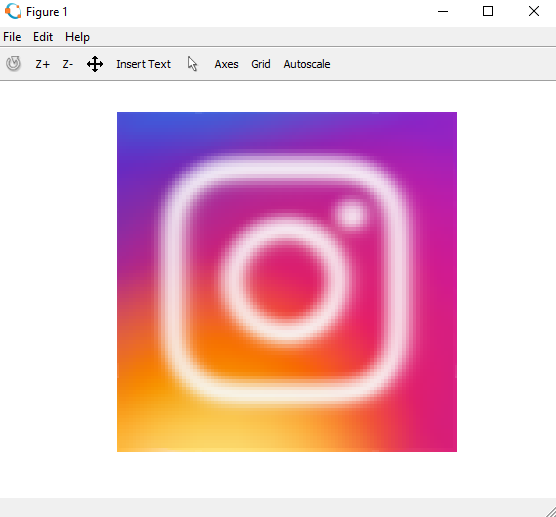

# MATLAB-Image-Blur

### Image Processing

Blur a colour image with different intensities.
--------
* I have taken average of `x` surrounding pixel.
* The function takes 2 parameters `arr` & `times`. `arr` is the image array & `times` is the intensity of blur. 
* I have set that average back to `x` surronding pixels.
* I type casted `uint8` pixel intensities to `double` to allow values greater that `255` while adding intensities to calculate average.
* `x` is a variable named `howmuch` in code. We can modify it according to our need. 

### Original Image 

### Blur Image with Intensity 1

### Blur Image with Intensity 2

### Blur Image with Intensity 3

### Blur Image with Intensity 4

